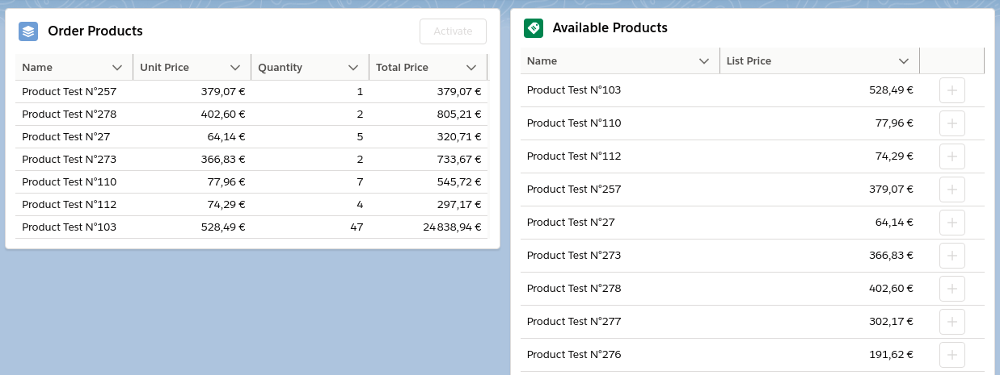

# Salesforce Order Manager (SFDX)

User can add products to order while not leaving record detail page.

## LWC

2 LWC independant components on order record page:

- `Available Products`
    - It displays available products suitable for Order based on Order’s price book
    - User can add a product from the list to the order
    - By adding an existing product in order, It increments order item quantity by 1
- `Order Products`
    - It displays products added to the current order
    - The activation button sends request to an external system via HTTP (`https://sf-order-manager.requestcatcher.com`) for order confirmation
- Both components can handle more than 200 records

# Notes

- `Pricebook` component has to be implemented to select order pricebook
- You can generate test data using [testData script](scripts/apex/testData.apex) script

[Video](https://drive.google.com/file/d/1T2qjw1CiisD88Y5Rc6y7bISHwLpueq6F/view)